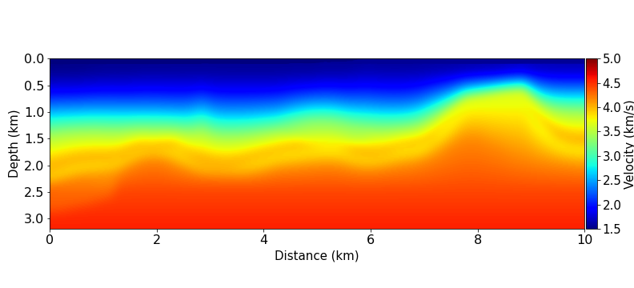
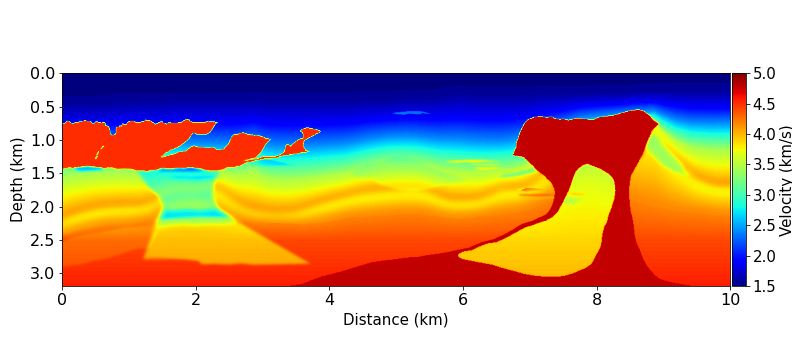
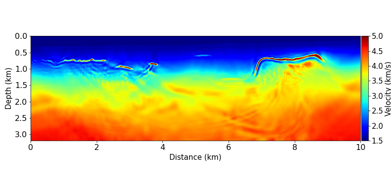
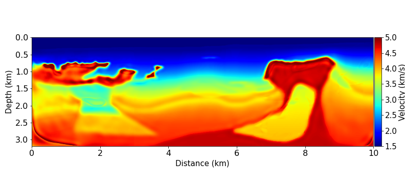

Repository for the paper "**Robust Full Waveform Inversion: A Source Wavelet Manipulation Perspective**"

# Usage
The main idea of the source manipulation inversion (SMI) is to transform the observed source data into Gaussian source data, thereby improving the convexity of the Full-Waveform Inversion (FWI) objective function. The complete SMI consists of source transformation and the traditional FWI. This repository only includes the deep learning method for solving the source transformation problem. For a more detailed introduction to SMI, please refer to the paper "**Robust Full Waveform Inversion: A Source Wavelet Manipulation Perspective**". The deep learning method for solving the source transformation problem consists of 3 steps:

## Step 1: Generating training data
You can generate training data in any way you prefer. We utilized the Python package [Devito](https://www.devitoproject.org/) to generate the training data.

## Step 2: Training
**train.py** is a framework for training process. Before using it, you need to make some modifications. First, you need to load your own training data in the **train.py**. Additionally, you can also adjust some hyperparameters.

## Step 3: Testing
**test.py** is a framework for testing process. You need to load your own testing data in the **test.py**.

# Description

- The **source_transformation.py** file is the neural network module for source_transformation.

- The **parameter.py** file contains data address and hyperparameters.

# Results （scaled BP 2004 model）:

| Initial model |          Ground truth                         |
| :-----------: | :----------------------------------------------------------: |
|            |  |

| Conventional FWI |          SMI                         |
| :-----------: | :----------------------------------------------------------: |
|            |  |

# Citation

BibTex

    @article{wang2022adapting,
        title={Adapting the residual dense network for seismic data denoising and upscaling},
        author={Wang, Rongqian and Zhang, Ruixuan and Bao, Chenglong and Qiu, Lingyun and Yang, Dinghui},
        journal={Geophysics},
        volume={87},
        number={4},
        pages={V321--V340},
        year={2022},
        publisher={Society of Exploration Geophysicists}
    }